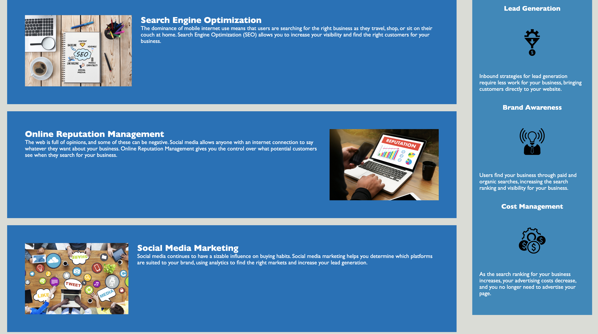

# Horiseon Media

## Description
#
This web page explains how Horiseon will teach clients how to use SEO, manage their online reputation, and use social media in order to grow their business. 

## Installation 
#
The web page was installed through pushing local code into github.

## Usage
#
This site's simple navigation allows users to explore Horiseon's services. Simply click on the tabs in the upper right hand corner in order to quickly view tha web page's rundown on SEO, reputation management, and social media marketing. 

## Credits
#
Credit goes to the entire staff and TA crew at the UCI coding bootcamp for providing us with outstanding instructions on how to build this awesome site. I hope everyone has a great Christmas break!

## License
#
N/A
#

Image of the top of the site:

Image of the bottom of the site:

